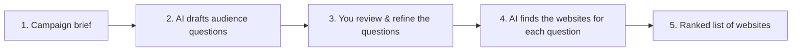

# How AdScope Works — A Complete, Plain-English Guide

> **Who this is for:** anyone — technical or not — who needs to understand
> AdScope end to end and explain it to others (clients, leadership, teammates).
> No coding knowledge required. A short glossary is at the end.

---

## 1. In one sentence

**AdScope tells you which websites your advertising should appear on — by
predicting the questions your target audience asks AI assistants, and then
discovering which websites those AI assistants rely on to answer.**

---

## 2. The problem AdScope solves

For years, deciding *where* to advertise meant relying on a media planner's
experience, traffic reports, and audience panels. That still matters — but how
people discover products has changed.

More and more, people don't start with Google or a magazine. They **ask an AI
assistant** — ChatGPT, Gemini, and others — questions like *"What's a good
organic sunscreen for daily use in India?"* The assistant answers by drawing on
a set of trusted websites, and often names or links them.

This creates a new, high-value question for advertisers:

> **When my audience asks an AI assistant about my product category, which
> websites does that assistant trust and surface?**

Those websites are prime advertising real estate — they're the sources shaping
your customer's decision at the exact moment of intent. AdScope is built to find
them systematically instead of guessing.

---

## 3. The big idea, in plain terms

AdScope runs a simple thought experiment at scale:

1. **Imagine your customer talking to an AI assistant.** What would they actually
   type? (e.g. *"Best cruelty-free moisturiser for sensitive skin?"*)
2. **Ask AI assistants those same questions** and note **which websites they'd
   consult** to answer.
3. **Collect and rank** all those websites. The ones that keep coming up — across
   many customer questions and across several AI assistants — are where your
   brand most wants to be seen.

That's the whole concept. Everything else is about doing this **reliably,
transparently, and with a human in control.**

---

## 4. The five stages, end to end

Here is the full journey, from a written brief to a ranked list of websites.

### Stage 1 — You describe the campaign (the *brief*)

You fill in a short form: client name, campaign name, the target country, the
objective (e.g. brand awareness), an optional budget, and a free-text briefing
describing the product, audience, and positioning.

*Example:* *"A premium organic skincare brand targeting women aged 25–40 in
major Indian cities. Objective: brand awareness."*

### Stage 2 — AI drafts the questions your audience would ask

AdScope sends your brief to **several AI models at once** and asks each one:
*"Imagine the real people in this audience. What would they type into their own
AI assistant when they have a need related to this product?"*

Each model returns a set of realistic questions (10 by default). Because
AdScope uses multiple models, you get a **rich, combined pool** — for three
models that's about 30 draft questions, covering different angles: research,
comparison, buying, how-to, local, and so on.

*Example questions:* *"What are the best premium organic skincare brands in India
right now?"*, *"Which face serums work well for humid monsoon weather?"*,
*"Where do beauty editors recommend shopping for skincare online?"*

### Stage 3 — You review and refine the questions (the human step)

This is deliberate and important. AdScope **pauses** and shows you every drafted
question in a clean editor. You can:

- **Edit** the wording of any question,
- **Remove** questions that don't fit,
- **Deselect** questions you want to keep on record but not use,
- **Add** your own custom questions.

Nothing proceeds until you click submit. This keeps a human expert in control of
what the system actually investigates — the AI proposes, **you decide**.

### Stage 4 — AI finds the websites for each question

For **every question you approved**, AdScope again asks **each AI model**: *"To
answer this question, which websites would you consult or cite?"* Each model
returns a list of websites with a relevance score and a short reason.

This is where the volume is: if you approved 10 questions and use 3 models,
that's 30 separate website lists. AdScope does this automatically in the
background and shows a progress screen while it works.

### Stage 5 — AdScope ranks everything into one list

All those website lists are merged into a **single ranked list of publishers**,
which is what you present and act on. How the ranking works is explained next.

---

## 5. Why AdScope uses several AI models (not just one)

Any single AI model can be biased, incomplete, or occasionally wrong. AdScope
deliberately asks **multiple independent models** and looks for **agreement** —
the same principle as asking several experts and trusting what they concur on.

- If three different models all say a website is relevant, that's a **strong**
  signal.
- If only one model mentions it, that's a **weaker** signal worth noting but not
  over-weighting.

AdScope is also **extensible**: it isn't locked to a fixed set of models. New AI
providers can be added as they emerge, without redesigning the system. Today it's
configured with three; tomorrow it could be more.

---

## 6. How the ranking works — two simple ideas

AdScope ranks websites using two intuitive measures. You don't need any maths to
explain them.

### Idea 1 — **Agreement** (do the AI models concur?)

For a **single question**, if several models independently name the same website,
they *agree*. More agreement = higher confidence that the site is genuinely
relevant to that question.

### Idea 2 — **Breadth** (does the site matter across many questions?)

A website that shows up for **one** question might be narrowly useful. A website
that shows up across **many** of your audience's questions is broadly important —
it sits at the centre of the conversation.

**AdScope prioritises breadth first, then agreement, then relevance score.** In
plain terms: *a website that keeps appearing across many customer questions, that
several AI models agree on, ranks at the top.* This is exactly the kind of
publisher you'd want your brand associated with.

Every website in the final list carries both signals so you can see *why* it
ranked where it did:

- **Queries** — how many of your questions surfaced this site (breadth).
- **Models** — the most AI models that agreed on it within a single question
  (agreement).
- **Breadth badge** — High / Medium / Low, a quick read on how widely it appeared.
- **Final score** — an overall relevance score (0–100).

---

## 7. What you get at the end

A **ranked table of recommended publishers**, each with:

- Website name and domain (e.g. *Vogue India — vogue.in*),
- Category (e.g. *Fashion & Lifestyle*),
- Final score, breadth, and agreement signals,
- A short reason it was recommended,
- A **"Details" drill-down** showing exactly which of your audience questions
  surfaced it and which AI models named it — full transparency, no black box.

You can **export the whole list to CSV** for spreadsheets, decks, or sharing.

---

## 8. A quick worked example

Let's follow the skincare campaign all the way through:

1. **Brief:** premium organic skincare, women 25–40, Indian metros, awareness.
2. **Drafted questions (Stage 2):** ~30 questions across three models, e.g.
   *"Best organic skincare for women in their 30s in India?"*,
   *"Which websites review clean beauty brands?"*
3. **Your review (Stage 3):** you keep the 12 sharpest questions, tweak two, and
   add one of your own: *"Which sites review vegan skincare?"*
4. **Website discovery (Stage 4):** for each of those 13 questions, three models
   each list the websites they'd consult.
5. **Final ranking (Stage 5):** *Vogue India* and *Nykaa* appear for almost every
   question and are named by all three models → they rank at the very top. Niche
   sites that appeared once or twice rank lower. You export the list and present
   it.

The output is defensible: for any website, you can show the exact questions and
models behind it.

---

## 9. Built-in flexibility (no rebuild needed)

AdScope is designed to be tuned to the situation:

- **How many questions each model drafts** (default 10),
- **How many websites each model returns per question** (default 10),
- **How long the final list can be** (default 50).

These have sensible defaults but can be **overridden per campaign** right on the
form (under "Advanced: pipeline sizes"), or changed globally in configuration.
Bigger numbers mean broader coverage but longer processing time — a simple
speed-vs-thoroughness dial.

There's also a **Demo Mode** that runs the entire flow with realistic sample data
and no live AI calls — perfect for demonstrations, training, or walking a client
through the experience without incurring cost.

---

## 10. Trust, transparency, and limitations

AdScope is built to be **advisory and auditable**, not a black box:

- **Human-in-the-loop by design.** The system never runs end to end without your
  review of the questions. You steer what it investigates.
- **Full traceability.** Every final recommendation can be traced back to the
  specific questions and AI models that produced it.
- **Resilient.** If one AI model fails or is slow, the others still produce
  results; the campaign is only marked failed if *everything* fails, and partial
  failures are flagged as "completed with warnings."
- **Honest about its nature.** Recommendations are **AI-generated and advisory.**
  The tool explicitly reminds users that website suitability, audience data,
  pricing, availability, and brand safety must be **verified by a qualified
  marketing professional** before any spend. AdScope does *not* invent traffic
  numbers or pricing.

Think of AdScope as a **very well-read research assistant** that rapidly surfaces
where the conversation is happening — with a human expert always making the final
call.

---

## 11. Why this matters (the pitch in three lines)

- **Audience behaviour has shifted** toward asking AI assistants for
  recommendations.
- **AdScope reveals which websites those assistants trust** for your product
  category — the modern equivalent of "where the audience is paying attention."
- **It does this transparently, with multiple AI models and a human in control**,
  producing a ranked, exportable, defensible list of where to advertise.

---

## 12. Glossary

| Term | Plain meaning |
|------|---------------|
| **Brief** | The written description of the campaign you enter to start. |
| **AI model / provider** | An AI assistant engine (e.g. Gemini, Groq, OpenRouter) AdScope asks questions. |
| **Query / audience question** | A realistic question your target customer might ask an AI assistant. |
| **Human review** | The step where you edit, add, remove, or approve the questions before analysis. |
| **Publisher / website** | A site where advertising could be placed (e.g. Vogue India). |
| **Agreement** | How many AI models independently named the same website for a question. |
| **Breadth** | Across how many of your questions a website appeared. |
| **Final score** | An overall 0–100 relevance measure for a recommended website. |
| **Consensus** | Combining several AI models' answers to find what they concur on. |
| **Demo Mode** | A no-cost mode that runs the full flow using realistic sample data. |
| **CSV export** | A spreadsheet download of the final ranked list. |

---

*AdScope is an internal media-planning aid. Its recommendations are advisory and
must be validated by an authorised professional before campaign execution.*
