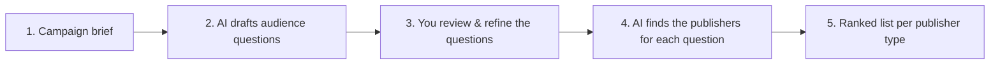

# How AdScope Works — A Complete, Plain-English Guide

> **Who this is for:** anyone — technical or not — who needs to understand
> AdScope end to end and explain it to others (clients, leadership, teammates).
> No coding knowledge required. A short glossary is at the end.
>
> **There is also a live version inside the app**, at **How it works** in the top
> navigation. That page renders the *actual* instructions AdScope sends to the AI
> models, pulled from the running system, so it can never drift out of date. This
> document is the portable version, for sharing outside the tool.

---

## 1. In one sentence

**AdScope tells you where your advertising should appear — which websites,
YouTube channels and apps — by predicting the questions your target audience
asks AI assistants, and then discovering where those assistants send people who
ask them.**

---

## 2. The problem AdScope solves

For years, deciding *where* to advertise meant relying on a media planner's
experience, traffic reports, and audience panels. That still matters — but how
people discover products has changed.

More and more, people don't start with Google or a magazine. They **ask an AI
assistant** — ChatGPT, Gemini, and others — questions like *"What's a good
organic sunscreen for daily use in India?"* The assistant answers by drawing on
a set of trusted websites, and often names or links them.

This creates a new, high-value question for advertisers:

> **When my audience asks an AI assistant about my product category, which
> publishers does that assistant lean on — and where is that audience's
> attention actually sitting?**

Those are prime advertising real estate — the sources shaping your customer's
decision at the exact moment of intent. AdScope is built to find them
systematically instead of guessing.

---

## 3. The big idea, in plain terms

AdScope runs a simple thought experiment at scale:

1. **Imagine your customer talking to an AI assistant.** What would they actually
   type? (e.g. *"Best cruelty-free moisturiser for sensitive skin?"*)
2. **Ask AI assistants those same questions** and note **where they would point** —
   the websites they'd consult, and the channels and apps that audience uses.
3. **Collect and rank** everything that comes back. What keeps coming up — across
   many customer questions and across several AI assistants — is where your
   brand most wants to be seen.

That's the whole concept. Everything else is about doing this **reliably,
transparently, and with a human in control.**

---

## 4. The five stages, end to end

Here is the full journey, from a written brief to a ranked list of publishers.

### Stage 1 — You describe the campaign (the *brief*)

You fill in a short form: client name, campaign name, the target country, the
objective (e.g. brand awareness), an optional budget, and a free-text briefing
describing the product, audience, and positioning.

You also make two choices that shape what comes back:

- **Which publisher types to look for** — websites, YouTube channels,
  applications, or any combination.
- **Whether to exclude competitors** — see section 8.

*Example brief:* *"A premium organic skincare brand targeting women aged 25–40 in
major Indian cities. Objective: brand awareness."*

### Stage 2 — AI drafts the questions your audience would ask

AdScope sends your brief to **several AI models at once** and asks each one:
*"Imagine the real people in this audience. What would they type into their own
AI assistant when they have a need related to this product?"*

Each model returns a set of realistic questions (10 by default). Because
AdScope uses multiple models, you get a **rich, combined pool** — for three
models that's about 30 draft questions, covering different angles: research,
comparison, buying, how-to, local, and so on.

*Example questions:* *"What are the best premium organic skincare brands in India
right now?"*, *"Which face serums work well for humid monsoon weather?"*,
*"Where do beauty editors recommend shopping for skincare online?"*

A progress bar shows how many models have answered while you wait.

### Stage 3 — You review and refine the questions (the human step)

This is deliberate and important. AdScope **pauses** and shows you every drafted
question in a clean editor. You can:

- **Edit** the wording of any question,
- **Remove** questions that don't fit,
- **Deselect** questions you want to keep on record but not use,
- **Add** your own custom questions.

Nothing proceeds until you click submit. This keeps a human expert in control of
what the system actually investigates — the AI proposes, **you decide**.

### Stage 4 — AI finds the publishers for each question

For **every question you approved**, AdScope asks **each AI model**, once for
**each publisher type** you ticked. Each model returns a list with a relevance
score and a short reason per entry.

This is where the volume is: 10 approved questions × 3 models × 2 publisher types
is 60 separate AI calls. AdScope runs them in the background and shows a live
progress bar — *"Sending 60 AI calls…"*, then a running count of answers
received — so you can see exactly how far along it is.

### Stage 5 — AdScope ranks everything into one list

All those lists merge into a **single ranked list per publisher type**, which is
what you present and act on. How the ranking works is explained in section 6.

---

## 5. What each choice on the form actually changes

Not every field does the same kind of work. Some steer *which questions get
drafted*, others steer *which publishers come back*. Being precise about this
saves a lot of misplaced expectation.

| Field | Where it acts | What it does |
|---|---|---|
| **Client briefing** | Stage 2 | Does most of the work. A brief naming the audience, category, positioning and season produces far sharper questions than a vague one. |
| **Client name** | Stages 2 & 4 | Part of the brief. Models are told **not** to mention your brand in the questions — a customer asks about a need, not about you. Also named in the competitor rule. |
| **Target country** | Stage 2 | Shapes the market the questions are written for, which is what pulls local publishers into the answers. |
| **Objective** | Stage 2 | Tilts the *kind* of question drafted. Awareness pulls toward broad discovery questions, which surface large editorial publishers; consideration or performance pulls toward comparison and buying questions, which surface review sites and marketplaces. |
| **Budget** | Stage 2 | Context only. It can nudge the models toward premium or mass-market framing. It does **not** filter publishers by cost. |
| **Publisher types** | Stage 4 | Decides which discovery questions get asked and which result tabs you get. Each extra type multiplies the number of AI calls. |
| **Exclude competitors** | Stage 4 | Adds a rule to every discovery prompt and filters the results afterwards (section 8). |
| **Queries per model** | Stage 2 | How many questions each model drafts (default 10). |
| **Results per query** | Stage 4 | How many publishers each model may return per question — set separately per type (default 10 each). |
| **Final list size** | Stage 5 | How long the finished ranking may be, per publisher type (default 50). A trim of the bottom only. |

> ⚠️ **Objective and budget influence the questions, not the ranking.** This is
> worth being precise about, because it is easy to assume otherwise. Both are read
> only when the audience questions are drafted. The discovery stage sees just one
> approved question at a time — it is never shown the objective or the budget, and
> no score is weighted by either. Their influence is real but entirely indirect:
> different questions in, different publishers out. If you want the objective to
> bite harder, say so in the briefing and keep the matching questions at the
> review step.

---

## 6. Why AdScope uses several AI models (not just one)

Any single AI model can be biased, incomplete, or occasionally wrong. AdScope
deliberately asks **multiple independent models** and looks for **agreement** —
the same principle as asking several experts and trusting what they concur on.

- If three different models all name a publisher, that's a **strong** signal.
- If only one mentions it, that's a **weaker** signal worth noting but not
  over-weighting.

AdScope is also **extensible**: it isn't locked to a fixed set of models. New AI
providers can be added as they emerge, without redesigning the system. Today it's
configured with three; tomorrow it could be more.

---

## 7. How the ranking works — two simple ideas

AdScope ranks publishers using two intuitive measures. You don't need any maths to
explain them.

### Idea 1 — **Agreement** (do the AI models concur?)

For a **single question**, if several models independently name the same
publisher, they *agree*. Their scores are averaged into one entry. More agreement
= higher confidence that it is genuinely relevant to that question.

### Idea 2 — **Breadth** (does it matter across many questions?)

A publisher that shows up for **one** question might be narrowly useful. One that
shows up across **many** of your audience's questions is broadly important — it
sits at the centre of the conversation.

### The ranking rule

Publishers are sorted by, in strict order:

1. **Breadth** — how many of your questions surfaced it. A publisher appearing for
   eight of your questions outranks one appearing for two, whatever their scores.
2. **Final score** — the average relevance across those questions, breaking ties.
3. **Name** — alphabetical, so the order is stable rather than arbitrary.

In plain terms: *a publisher that keeps appearing across many customer questions,
that several AI models agree on, ranks at the top.*

Every row carries both signals so you can see *why* it ranked where it did:

- **Queries** — how many of your questions surfaced it (breadth).
- **Models** — the most AI models that agreed on it within a single question
  (agreement).
- **Breadth badge** — High / Medium / Low. High means it appeared for at least
  **66%** of your approved questions, Medium at least **33%**, Low below that.
- **Final score** — an overall relevance score (0–100).

Each publisher type is ranked **separately**, so a website never competes for
position with an app.

---

## 8. Websites, YouTube channels and apps

The three types are not three flavours of the same search. Each is asked a
genuinely different question, because the underlying behaviour differs.

| Type | The question asked | How duplicates are matched |
|---|---|---|
| **Websites** | *"To answer this, which websites or publishers would you consult or cite?"* — a **citation** frame | By domain, ignoring `https://`, `www.` and any path. |
| **YouTube channels** | *"Whose content is a person with this need genuinely likely to watch?"* — an **attention** frame | By channel handle, so a full URL and a bare `@handle` collapse into one. |
| **Applications** | *"Which apps is a person with this need likely to have installed and use?"* — an **attention** frame | By app name. Models return different store listings for iOS, Android and different regions, so the name is the only stable identity; platform is kept as a detail. |

An AI assistant doesn't *cite* a mobile app to answer a factual question, so
asking it that way would produce nonsense — hence the different framings.
Everything after that point (agreement, breadth, ranking, the final trim) is
identical across the three.

---

## 9. Keeping competitors out

The output is a **buying list**. A rival brand will not sell you space on its own
website, channel or app, so a competitor in your results isn't just awkward — it
is a row nobody can act on.

Ticking **exclude competitors** on the form handles this in two passes, because
one is not reliable on its own:

1. **The models are told.** A rule is added to every discovery instruction,
   naming your brand and any competitors you list.
2. **The results are filtered anyway.** AI models follow negative instructions
   unevenly, so anything that still comes back matching a competitor you named is
   removed before the ranking is built. This pass doesn't depend on a model's
   cooperation.

The filter matches on brand identity rather than exact spelling, so naming
*Kama Ayurveda* also catches *Kama Ayurveda India* and `kamaayurveda.com`.

> **A retailer that stocks a rival is not a competitor.** The rule targets
> *brand-owned* properties only. Marketplaces, retailers, magazines and creators
> that cover many brands are exactly where you want to advertise, even though they
> carry competitors' products — so they are deliberately kept. Name only the brands
> you compete with, not the places that sell them.

Naming competitors is optional but makes a large difference: with names the filter
is exact; without them you are relying on the models' own read of who competes
with you. Leaving the box unticked keeps everything, which is right when you are
researching a category rather than planning a buy.

---

## 10. What you get at the end

A **ranked table per publisher type**, shown as tabs, each row with:

- Name and locator (e.g. *Vogue India — vogue.in*, *Hyram — @Hyram*),
- Category (e.g. *Fashion & Lifestyle*),
- Final score, breadth, and agreement signals,
- A short reason it was recommended,
- A **"Details" drill-down** showing exactly which of your audience questions
  surfaced it and which AI models named it — full transparency, no black box.

You can **export everything to CSV** for spreadsheets, decks, or sharing.

A practical way to read the table: treat the **High**-breadth rows as your core
buy, **Medium** as the expansion list, and **Low** as leads worth a look rather
than conclusions.

---

## 11. A quick worked example

Let's follow the skincare campaign all the way through:

1. **Brief:** premium organic skincare, women 25–40, Indian metros, awareness.
   Publisher types: websites and YouTube channels. Competitors excluded, naming
   *Nykaa* and *Purplle*.
2. **Drafted questions (Stage 2):** ~30 questions across three models, e.g.
   *"Best organic skincare for women in their 30s in India?"*,
   *"Which websites review clean beauty brands?"*
3. **Your review (Stage 3):** you keep the 12 sharpest questions, tweak two, and
   add one of your own: *"Which sites review vegan skincare?"*
4. **Discovery (Stage 4):** 13 questions × 3 models × 2 types = 78 AI calls,
   run in the background with a live progress bar.
5. **Final ranking (Stage 5):** for the question *"Which face serums work in
   humid monsoon weather?"*, two of three models name `vogue.in` at 88 and 82 —
   one entry at **85**, named by **2 models**. Across all 13 questions it comes
   back for 11, averaging **84**, so it lands at the top with a **High** breadth
   badge. *Nykaa* would have ranked near the top too, but it was named as a
   competitor and never appears. A niche blog that scored a brilliant 95 on one
   question and never reappeared sits far below — one strong opinion, no
   corroboration.

The output is defensible: for any row, you can show the exact questions and
models behind it.

---

## 12. Built-in flexibility (no rebuild needed)

AdScope is designed to be tuned to the situation:

- **How many questions each model drafts** (default 10),
- **How many results each model returns per question** — set **separately for
  websites, YouTube channels and apps** (default 10 each),
- **How long the final list can be**, per publisher type (default 50).

These have sensible defaults but can be **overridden per campaign** right on the
form (under "Advanced: pipeline sizes"), or changed globally in configuration.
Bigger numbers mean broader coverage but longer processing time — a simple
speed-vs-thoroughness dial.

There's also a **Demo Mode** that runs the entire flow with realistic sample data
and no live AI calls — perfect for demonstrations, training, or walking a client
through the experience without incurring cost.

---

## 13. Trust, transparency, and limitations

AdScope is built to be **advisory and auditable**, not a black box:

- **Human-in-the-loop by design.** The system never runs end to end without your
  review of the questions. You steer what it investigates.
- **Full traceability.** Every final recommendation can be traced back to the
  specific questions and AI models that produced it. The in-app *How it works*
  page even shows the exact instructions sent to the models.
- **Resilient.** If one AI model fails or is slow, the others still produce
  results; the campaign is only marked failed if *everything* fails, and partial
  failures are flagged as "completed with warnings."
- **Honest about its nature.** Recommendations are **AI-generated and advisory.**

What it is *not*:

- **A measurement.** It reflects what these models said at the time you ran it —
  not a guarantee of citation, traffic, or placement availability.
- **A source of commercial data.** No inventory, no rate cards, no reach figures.
  The models are explicitly instructed never to invent them.
- **A brand-safety check.** A publisher can be highly relevant and entirely wrong
  for your brand. That judgement stays human.
- **Unbounded by your questions.** It can only find publishers relevant to the
  questions you approved — which is exactly why that step is yours.

Website suitability, audience data, pricing, availability, and brand safety must
be **verified by a qualified marketing professional** before any spend.

Think of AdScope as a **very well-read research assistant** that rapidly surfaces
where the conversation is happening — with a human expert always making the final
call.

---

## 14. Why this matters (the pitch in three lines)

- **Audience behaviour has shifted** toward asking AI assistants for
  recommendations.
- **AdScope reveals where those assistants send people** for your product
  category, across websites, channels and apps — the modern equivalent of "where
  the audience is paying attention."
- **It does this transparently, with multiple AI models and a human in control**,
  producing a ranked, exportable, defensible list of where to advertise.

---

## 15. Glossary

| Term | Plain meaning |
|------|---------------|
| **Brief** | The written description of the campaign you enter to start. |
| **AI model / provider** | An AI assistant engine (e.g. Gemini, Groq, OpenRouter) AdScope asks questions. |
| **Query / audience question** | A realistic question your target customer might ask an AI assistant. |
| **System prompt** | The standing instructions a model is given before the specific question. |
| **Human review** | The step where you edit, add, remove, or approve the questions before analysis. |
| **Publisher** | Anywhere an ad could run — a website, a YouTube channel, or an app. |
| **Publisher type** | Which of those three kinds AdScope is looking for. Each is ranked separately. |
| **Agreement** | How many AI models independently named the same publisher for a question. |
| **Breadth** | Across how many of your questions a publisher appeared. The primary ranking signal. |
| **Final score** | An overall 0–100 relevance measure for a recommended publisher. |
| **Consensus** | Combining several AI models' answers to find what they concur on. |
| **Competitor exclusion** | Optionally leaving rival brands' own sites, channels and apps out of the results. |
| **Demo Mode** | A no-cost mode that runs the full flow using realistic sample data. |
| **CSV export** | A spreadsheet download of the final ranked list. |

---

*AdScope is an internal media-planning aid. Its recommendations are advisory and
must be validated by an authorised professional before campaign execution.*
